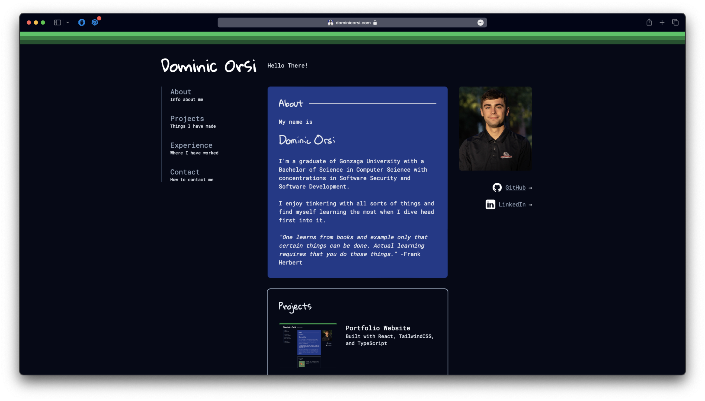

<div align="center">
    <p>
        <a href="#">
            <a href="https://dominicorsi.com">
        </a>
    </p>
    <h1>Portfolio Website</h1>
    <p>
        <a href="#"> </a>
            <a href="https://github.com/dominicorsi/dominiorsi.com/actions/worflows/firebase-hosting-merge.yml"> 
            </a> 
    <p>

</div>

## Portfolio Website
This repository holds the code to my personal portfolio page. If all is going well in my life I should be updating this page regularly with updates or fixes.

This page serves as a way for me communicate my skills, hobbies, and projects to anyone who comes across the page. 

### Goals
- [ ] Database backend so updates and blog are not hardcoded into page

## Project Setup/Install
- Install all packages for development

```
npm install
```

### Compile and Hot-Reload for Development
- Serves the webpage on localhost port 5173

```
npm run dev
```

### Deployment
- Merge into main branch and [GitHub action](.github/workflows/firebase-hosting-merge.yml) will run to serve the new webpage to firebase.

## Technologies Used
The webpage was built with [React](https://react.dev), [tailwindcss](https://tailwindcss.com), and [TypeScript](https://www.typescriptlang.org).

Icons are from [Icons8](https://icons8.com).

I am using [Firebase](https://firebase.google.com) for hosting the static site as it is free and then Firebase GitHub actions to deploy.